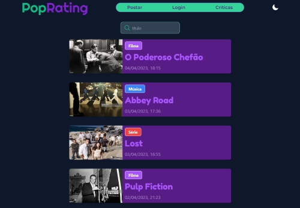

# PopRating :star:

Esta é uma versão antiga que ainda utiliza Pages Router, e não a versão mais recente do Next.js.

#### A versão mais recente pode ser encontrada [aqui](https://github.com/joaovsampaio/PopRating).

## O projeto utiliza:

- [Next.JS](https://nextjs.org/)
- [TypeScript](https://www.typescriptlang.org/)
- [Tailwind](https://tailwindcss.com/)
- [Prisma](https://www.prisma.io/)
- [React Hook Form](https://react-hook-form.com/)
- [Zod](https://zod.dev/)
- [Radix UI](https://www.radix-ui.com/)

## Site

Banco de dados - [PlanetScale](https://planetscale.com/)

## Imagens :arrow_down:




## Utilização Do Repositório:

#### Muitas variáveis de ambiente serão necessárias para a aplicação rodar.

### 1. Faça Download Do Repositório:

Após clonar ou baixar o resposiório. :arrow_down:

Instale as dependências utilizando o terminal com o comando:

```
npm i
```

### 2. Execute a Aplicação:

Execute o servidor de desenvolvimento:

```
npm run dev
```

Abra [http://localhost:3000](http://localhost:3000) com seu navegador para ver o resultado.
